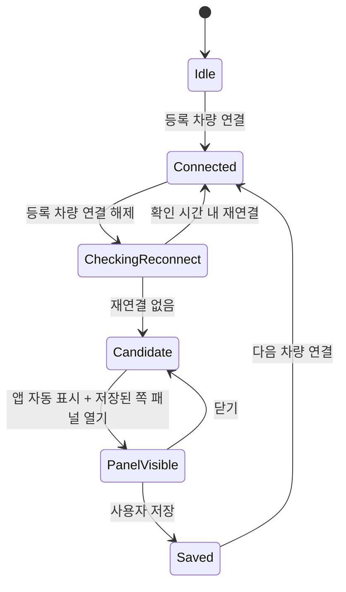

# 기술 명세

## 기본 구조

Kotlin + Jetpack Compose. 화면과 상태는 ViewModel/StateFlow로 분리한다. Room은 확정 기록·방문 보정 정보, DataStore는 등록 차량·패널 위치·디자인 테마·설정값을 저장한다. 실제 지도 SDK는 지도 인터페이스 뒤에 둔다. 첫 버전은 서버 없이 로컬 저장한다.

권장 모듈 구분: `ui/home`, `ui/drawer`, `ui/onboarding`, `ui/settings`, `domain/parking`, `domain/floor`, `data/bluetooth`, `data/sensor`, `data/location`, `data/storage`, `platform/autolaunch`, `platform/permissions`.

## 상태 전이



전이 상태와 기존 `ParkingRecord`는 별개다. 다음 연결이 기존 기록을 자동으로 지우지 않는다. 후보 생성 시각은 연결 해제 시각이며 저장 버튼을 누른 시각으로 주차 시작 시간을 바꾸지 않는다. 중복 이벤트는 같은 세션의 후보 하나로 병합한다.

## 연결 이벤트

- Android의 ACL 연결/해제 이벤트는 낮은 수준의 링크 상태다. 기기 주소/등록 식별자와 필요한 profile 상태를 함께 확인한다.
- 자동차가 여러 profile을 유지할 때 한 profile 해제만으로 주차로 판단하지 않게 실제 차량에서 검증한다.
- 다른 이어폰·시계의 이벤트는 무시한다.
- 연결 해제 시 센서·위치 스냅샷을 먼저 확보한다. 재연결 확인 중 사용자가 걸어 올라간 기압으로 차량 층수를 바꾸지 않는다.
- 재연결 확인 기본값 6초는 조정 가능한 초안이다. 재연결 시 타이머와 후보 생성을 취소한다.
- 사용자가 Bluetooth 자체를 끈 상황을 별도 원인으로 구분하고 일반적인 차량 해제와 섞지 않는다.

## 앱 자동 표시

사용자가 사전 설정을 완료한 지원 기기에서 화면을 자동으로 가져오는 것이 기본이다.

1. 연결 해제 이벤트를 수신할 수 있는 감지 실행 구조를 확보한다. 프로세스가 이미 죽은 상태까지 runtime receiver만으로 보장하지 않는다.
2. `Settings.canDrawOverlays()` 등으로 ‘다른 앱 위에 표시’ 상태를 확인한다. Android 공식 문서는 SYSTEM_ALERT_WINDOW를 백그라운드 Activity 실행 예외 중 하나로 명시한다.
3. Activity 실행과 foreground service 시작은 서로 다른 규칙이다. Android 12 이상 FGS 백그라운드 시작 제한을 별도 처리한다. Android 15 이상에서 SAW 예외로 FGS를 시작할 때는 실제로 보이는 overlay 조건이 있다.
4. 후보 ID와 패널 열기 상태를 전달해 홈 Activity를 자동 표시한다. 기존 Activity 재사용, 중복 화면 방지, 마지막 패널 위치 복원.
5. 잠금 화면 표시에는 `setShowWhenLocked(true)`, 화면 켜기에는 `setTurnScreenOn(true)`를 적절히 적용한다. 이 플래그만으로 백그라운드 실행 권한이 생기는 것은 아니다.
6. 보안 잠금 해제는 정상 시스템 인증을 사용한다. 화면 표시와 잠금 해제를 동일한 기능으로 취급하지 않는다.

Companion Device Manager/기기 presence 등은 차량 및 OS 호환성을 실제로 확인한 후 감지 구조 후보로 평가한다. 일반 차량 오디오가 BLE GATT peripheral이라고 가정하지 않는다. 불필요한 접근성 서비스나 전화·알람용 전체 화면 알림으로 주차 팝업을 흉내 내지 않는다.

지원 상태는 `Ready`, `PermissionMissing`, `MonitoringStopped`, `Unsupported`, `NeedsDeviceTest`처럼 구분한다. 설정이 준비되지 않았을 때 자동 기록 아이콘을 켜짐으로 표시하지 않는다. 실제 감지 서비스에 필요한 시스템 알림은 앱 화면 자동 표시와 별개이며 사용자의 알림 탭을 진입 조건으로 만들지 않는다.

## 권한·설정

| 필요 | 처리 |
|---|---|
| 등록 기기 연결 상태 | Android 12 이상 Nearby devices/BLUETOOTH_CONNECT 등 실제 API에 필요한 권한 |
| 기기 검색 | 검색 방식에 필요한 권한만 요청, 이미 페어링된 기기 목록 우선 |
| 주차 좌표 | 위치 권한과 사용 시점/백그라운드 수집 범위를 구분 |
| 감지 FGS·알림 | 목표 SDK의 서비스 타입·권한·알림 규칙 확인 |
| 자동 화면 표시 | 다른 앱 위에 표시 등 적용 실행 경로의 실제 조건 확인 |
| 사진 선택 | 가능하면 시스템 Photo Picker, 영속 URI 또는 앱 전용 복사 |
| 사진 직접 촬영 | 사용자가 카메라 동작을 선택한 시점에 필요한 권한/인증 |
| OEM 제한 | 실제 지원 기기에 필요한 경우에만 해당 실행 설정 안내 |

초기 설정은 권한 이름 나열보다 사용 이유, 설정으로 이동, 돌아온 후 상태 재확인을 제공한다. 임의로 권한을 허용했다고 표시하지 않는다.

## 기압 추천

절대 기압 한 번만 읽어 B2로 판정하지 않는다. 현재 방문의 최근 기준점과 주차 시점 간 상대 높이 차이를 계산한다. Android `SensorManager.getAltitude()`로 두 측정값의 상대 높이를 비교할 수 있다.

필요 입력: 기압 센서 존재, 최근 기준 기압·시각, 알려진 기준층, 건물의 대략적 층간 높이, 주차 시점의 안정된 압력 샘플. 기준점이 부정확하거나 주차장 입구가 1F가 아닌 경우를 구분한다.

계산 개념: `층수 변화 ≈ 상대 높이 변화 / 해당 건물의 층간 높이`. 표기 변환 시 0F를 제거하고 지하층·1F 전이를 별도로 다룬다. 날씨·환기·차량 실내 압력 변화와 장시간 간격 때문에 과거 절대 기압을 그대로 재사용하지 않는다. 사용자가 확정한 층수는 보정 정보이지 다음 방문의 절대 기준 압력을 보장하지 않는다.

추천에는 `High/Medium/Low/Unavailable` 같은 내부 상태와 근거를 둔다. 검증되지 않은 정확도 퍼센트를 UI에 표시하지 않는다. 충분한 기준이 없으면 추천을 생략한다. 사용자가 직접 선택한 이후 추천 결과가 와도 선택을 바꾸지 않는다.

## 지도와 위치

네이버 Android 지도 SDK와 커스텀 스타일 ID를 1차 구현 방향으로 사용한다. `docs/MAP_DESIGN.md`를 함께 따른다. SDK 초기화·키·최신 이용 조건을 구현 시 확인한다. 키는 별도 로컬 설정이나 빌드 설정으로 넣고 저장소에 실제 키를 커밋하지 않는다.

주차 기록은 좌표뿐 아니라 수집 시각, 정확도, 출처를 함께 저장한다. 지하에서는 마지막 신뢰 위치나 알려진 건물/입구 위치로 대체할 수 있지만 실제 차량의 실내 주차 면 좌표라고 표시하지 않는다. 좌표가 없어도 층수·사진 저장은 가능해야 한다. 지도 로고·저작권 등 SDK 요구 표시는 유지한다.

## 데이터 초안

```json
{
  "settings": {
    "schemaVersion": 1,
    "registeredVehicleId": "local-device-id",
    "autoRecordRequested": true,
    "drawerSide": "left",
    "appTheme": "classic",
    "onboardingCompleted": false
  },
  "parkingRecord": {
    "id": "uuid",
    "vehicleId": "local-device-id",
    "detectedAt": "ISO-8601 instant",
    "confirmedAt": "ISO-8601 instant",
    "floorLevel": -2,
    "floorLabel": "B2",
    "placeName": null,
    "zoneMemo": null,
    "photoReference": null,
    "latitude": null,
    "longitude": null,
    "locationAccuracyMeters": null,
    "locationCapturedAt": null,
    "locationSource": "unavailable",
    "detectionSource": "bluetooth-disconnect"
  }
}
```

`floorLevel`: 1=1F, 2=2F, -1=B1。0은 사용하지 않으며 미선택은 null이다. `registeredVehicleId`는 외부에 공유하지 않는 로컬 식별자다. 사진 데이터와 원본 센서 로그는 별도 저장 정책으로 관리한다. 경과 시간은 저장된 `detectedAt`에서 계산한다. 영속 설정의 요청 값과 현재 OS 권한에서 도출하는 실제 준비 상태를 분리한다.

## 프로토타입과 네이티브 구분

브라우저 프로토타입은 직접 선택·드래그·저장·데모 설정을 확인하는 참고 구현이다. Bluetooth 해제, 센서, 실제 지도, 잠금 화면, Android 권한과 연결되어 있지 않다. Android 단계에서 이 명세에 따라 플랫폼 기능을 연결해야 한다.

## 디자인 테마 상태

`AppThemeId.Classic` / `AppThemeId.Steel`을 DataStore에 보관한다. 신규 설치·기존 설정에 값 없음·알 수 없는 값은 Classic. 사용자가 선택하면 즉시 테마 상태를 갱신하고 저장한다. 시스템 라이트/다크 변경은 명시적으로 선택한 값을 덮어쓰지 않는다.

홈·패널·첫 시작·설정을 공통 테마로 감싼다. 저장값을 복원한 후 최초 화면 및 자동 표시 진입을 그린다. 테마 변경이 주차 후보·저장 기록·센서·타이머·Bluetooth·사진·패널 위치를 초기화하지 않도록 UI appearance 상태를 도메인 상태와 분리한다. 지도는 두 테마 모두 참조에 맞춘 같은 밝은 커스텀 스타일을 유지한다. `docs/THEME_DESIGN.md` 참조.

## 현재 위치 상태 분리

`CurrentLocationState`는 실시간 화면 상태이며 Room의 `ParkingRecord`와 분리한다. 위치 업데이트는 현재 위치 오버레이만 이동시키고 확정 주차 핀을 덮어쓰지 않는다. 화면 활성 수명에 맞춰 업데이트를 등록·해제하고 좌표 시각·정확도·권한을 확인한다. 재중앙 버튼은 최신 현재 위치에만 적용한다. 도보 경로 계산 서비스는 이번 MVP에 추가하지 않는다.
